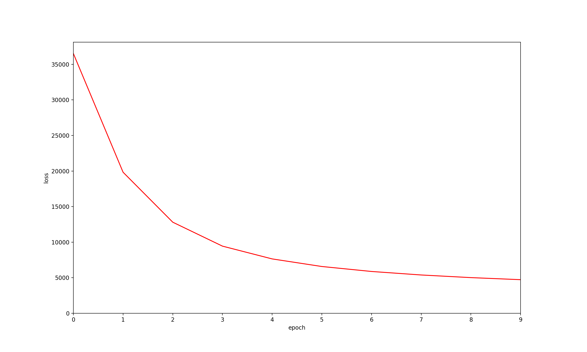

### FISM: Factored Item Similarity Models for Top-N Recommender Systems
An Implementation of "FISM: Factored Item Similarity Models for Top-N Recommender Systems"

Kabbur, Santosh , and G. Karypis . "FISM : Factored Item Similarity Models for Top-N Recommender Systems." Acm Sigkdd International Conference on Knowledge Discovery & Data Mining ACM, 2013.

### FISMrmse

loss

when epochs = 10

|       |  HR@10 | NDCG@10 | ARHR@10|
|:-----:|:------:|:-------:|:------:|
|ml-100k| 0.4411 | 0.2415  | 0.1810 |

### FISMauc